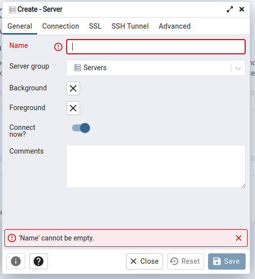
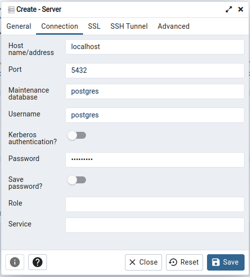

### Installation and configuration of Database

- [PosgreSQL](https://www.postgresql.org/.)

PostgreSQL is available in all Ubuntu version by default =D

## Install PostgresSQL on Linux

[Install on Linux](https://www.postgresqltutorial.com/install-postgresql-linux/)

## Install Graphic interface:

[pgAdmin](https://www.pgadmin.org/download/pgadmin-4-apt/)

## Start Database: Connect to the PostgreSQL database server via psql

When you installed PostgreSQL, the installation process created a user account called postgres associated with the default postgres role.

To connect to PostgreSQL using the postgres role, you switch over to the postgres account on your server by typing:

`sudo -i -u postgres`

You need to provide the password and hit the Enter keyboard. Then, you can access the PostgreSQL using the psql by typing the following command:

`psql`

By default, the user postgres does not have a password/ To be able to connect with pgdamin, setting a password is necessary. This can be done on the console with :

`alter user postgres with password 'your_password';`

## First setting on pgAdmin

1. On the left panel: right click on `Servers`->`Create Server`

2. Insert the server name, the host (localhost for example), username and password.

## Extra resources:

[Video Tutorial installation and config pgadmin](https://www.youtube.com/watch?v=40uGNsi7ysc)

